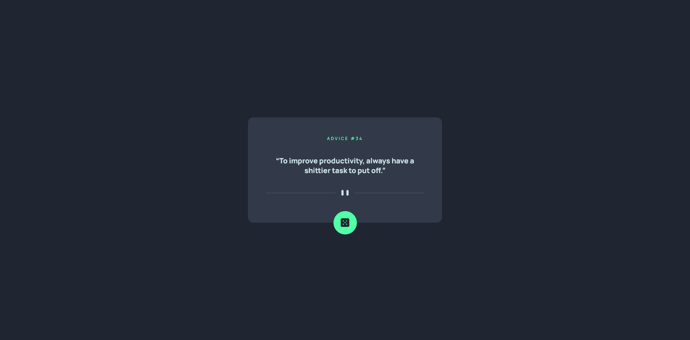
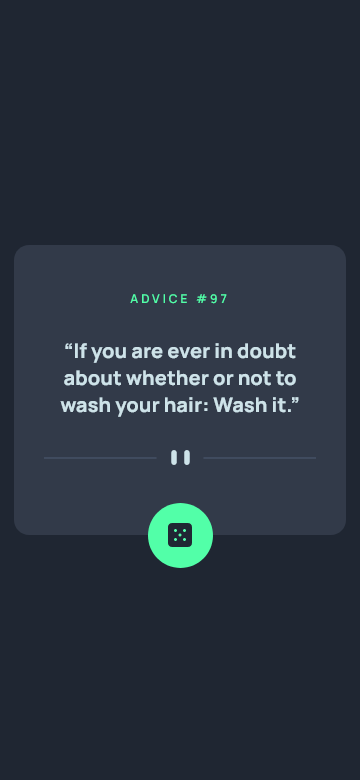

# Frontend Mentor - Advice generator app solution

This is a solution to the
[Advice generator app challenge on Frontend Mentor](https://www.frontendmentor.io/challenges/advice-generator-app-QdUG-13db).
Frontend Mentor challenges help you improve your coding skills by building
realistic projects.

## Table of contents

-   [Overview](#overview)
    -   [The challenge](#the-challenge)
    -   [Screenshot](#screenshot)
    -   [Links](#links)
-   [My process](#my-process)
    -   [Built with](#built-with)
-   [Author](#author)

## Overview

### The challenge

Users should be able to:

-   View the optimal layout for the app depending on their device's screen size
-   See hover states for all interactive elements on the page
-   Generate a new piece of advice by clicking the dice icon

### Screenshot

### Links

-   [Solution](https://github.com/ShivangamSoni/FrontEndMentor/tree/main/Advice-Generator-App)
-   [Live Demo](https://ShivangamSoni.github.io/FrontEndMentor/Advice-Generator-App)

## My process

### Built with

-   HTML5
-   CSS3
-   JavaScript

## Author

-   [Shivangam Soni](https://shivangam-soni.vercel.app/)
-   Frontend Mentor -
    [@ShivangamSoni](https://www.frontendmentor.io/profile/ShivangamSoni)
-   GitHub - [@ShivangamSoni](https://github.com/ShivangamSoni)
