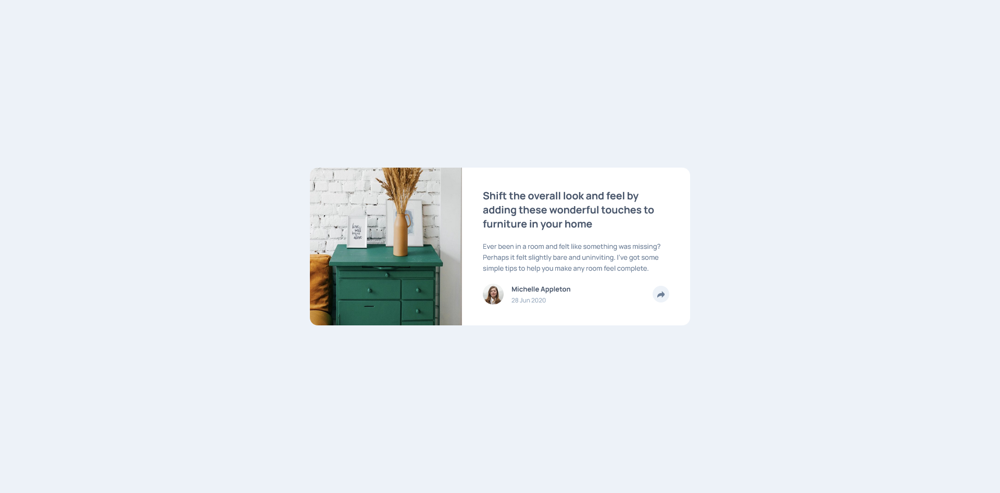
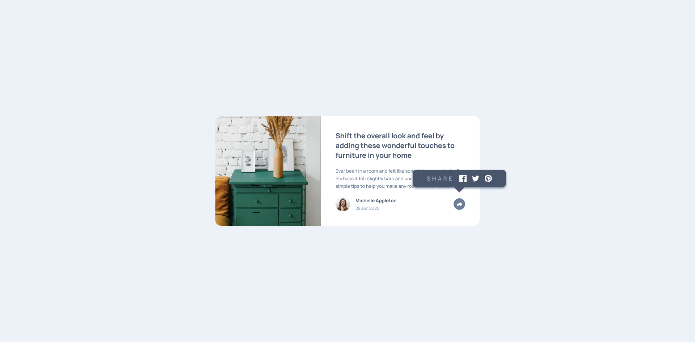
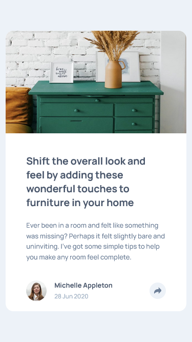
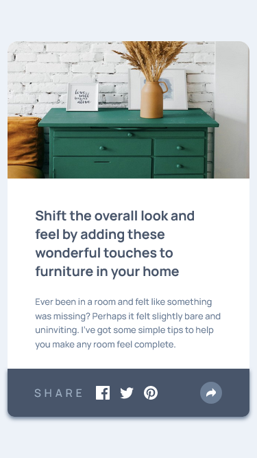

# Frontend Mentor - Article preview component solution

This is a solution to the
[Article preview component challenge on Frontend Mentor](https://www.frontendmentor.io/challenges/article-preview-component-dYBN_pYFT).
Frontend Mentor challenges help you improve your coding skills by building
realistic projects.

## Table of contents

-   [Overview](#overview)
    -   [The challenge](#the-challenge)
    -   [Screenshot](#screenshot)
    -   [Links](#links)
-   [My process](#my-process)
    -   [Built with](#built-with)
-   [Author](#author)

**Note: Delete this note and update the table of contents based on what sections
you keep.**

## Overview

### The challenge

Users should be able to:

-   View the optimal layout for the component depending on their device's screen
    size
-   See the social media share links when they click the share icon

### Screenshot

| Standard                              | Popup Active                                        |
| ------------------------------------- | --------------------------------------------------- |
|  |  |
|    |    |

### Links

-   [Solution](https://github.com/ShivangamSoni/FrontEndMentor/tree/main/Article-Preview-Component)
-   [Live Demo](https://ShivangamSoni.github.io/FrontEndMentor/Article-Preview-Component)

## My process

### Built with

-   HTML5
-   CSS3
-   JavaScript

## Author

-   [Shivangam Soni](https://shivangam-soni.vercel.app/)
-   Frontend Mentor -
    [@ShivangamSoni](https://www.frontendmentor.io/profile/ShivangamSoni)
-   GitHub - [@ShivangamSoni](https://github.com/ShivangamSoni)
