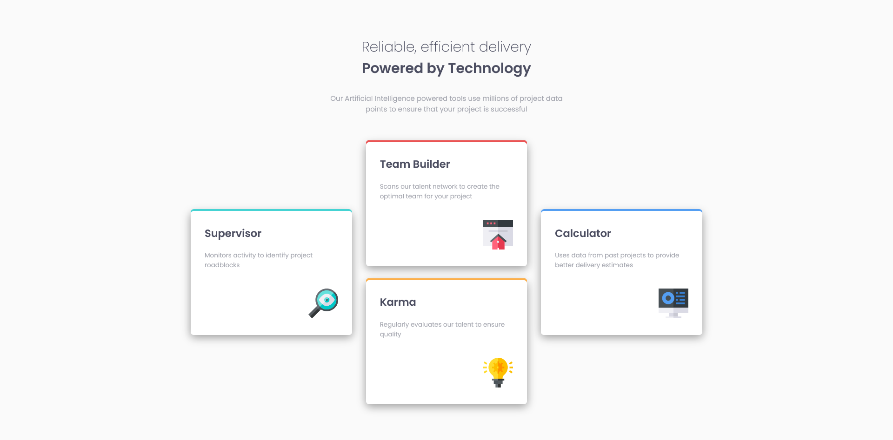
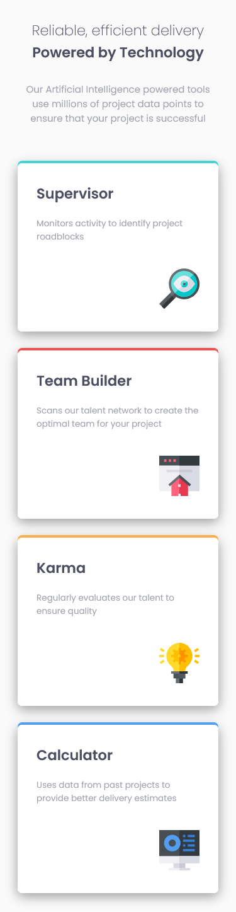

# Frontend Mentor - Four card feature section solution

This is a solution to the
[Four card feature section challenge on Frontend Mentor](https://www.frontendmentor.io/challenges/four-card-feature-section-weK1eFYK).
Frontend Mentor challenges help you improve your coding skills by building
realistic projects.

## Table of contents

-   [Overview](#overview)
    -   [The challenge](#the-challenge)
    -   [Screenshot](#screenshot)
    -   [Links](#links)
-   [My process](#my-process)
    -   [Built with](#built-with)
-   [Author](#author)

## Overview

### The challenge

Users should be able to:

-   View the optimal layout for the site depending on their device's screen size

### Screenshot

| Desktop                               | Mobile                              |
| ------------------------------------- | ----------------------------------- |
|  |  |

### Links

-   [Solution](https://github.com/ShivangamSoni/FrontEndMentor/tree/main/Four-Card-Feature-Section)
-   [Live Demo](https://ShivangamSoni.github.io/FrontEndMentor/Four-Card-Feature-Section)

## My process

### Built with

-   HTML5
-   CSS3

## Author

-   [Shivangam Soni](https://shivangam-soni.vercel.app/)
-   Frontend Mentor -
    [@ShivangamSoni](https://www.frontendmentor.io/profile/ShivangamSoni)
-   GitHub - [@ShivangamSoni](https://github.com/ShivangamSoni)
