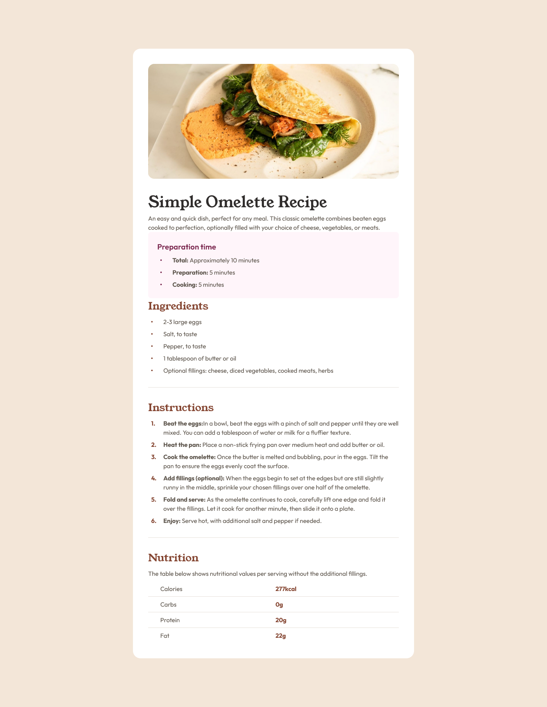
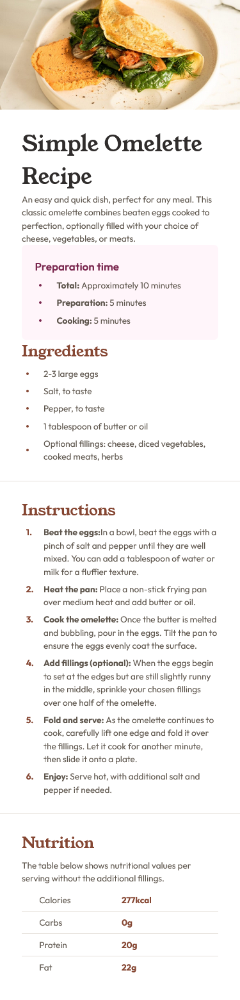

# Frontend Mentor - Recipe page solution

This is a solution to the [Recipe page challenge on Frontend Mentor](https://www.frontendmentor.io/challenges/recipe-page-KiTsR8QQKm). Frontend Mentor challenges help you improve your coding skills by building realistic projects.

## Table of contents

-   [Frontend Mentor - Recipe page solution](#frontend-mentor---recipe-page-solution)
    -   [Table of contents](#table-of-contents)
    -   [Overview](#overview)
        -   [Screenshot](#screenshot)
        -   [Links](#links)
    -   [My process](#my-process)
        -   [Built with](#built-with)
    -   [Author](#author)

## Overview

### Screenshot

| Screenshots                    |
| ------------------------------ |
|  |
|   |

### Links

-   [Solution](https://github.com/ShivangamSoni/FrontEndMentor/tree/main/Recipe-Page)
-   [Live Demo](https://ShivangamSoni.github.io/FrontEndMentor/Recipe-Page)

## My process

### Built with

-   Semantic HTML5
-   CSS3

## Author

-   [Shivangam Soni](https://shivangam-soni.vercel.app/)
-   GitHub - [@ShivangamSoni](https://github.com/ShivangamSoni)
-   LinkedIn - [shivangam-soni](https://www.linkedin.com/in/shivangam-soni/)
-   Frontend Mentor -
    [@ShivangamSoni](https://www.frontendmentor.io/profile/ShivangamSoni)
-   CodePen - [ShivangamSoni](https://codepen.io/ShivangamSoni)
-   iCodeThis - [Shivangam_Soni](https://icodethis.com/Shivangam_Soni)
-   StackOverflow - [shivangam-soni](https://stackoverflow.com/users/16659219/shivangam-soni)
-   ORCiD - [Shivangam Soni](https://orcid.org/0009-0002-3449-817X)
